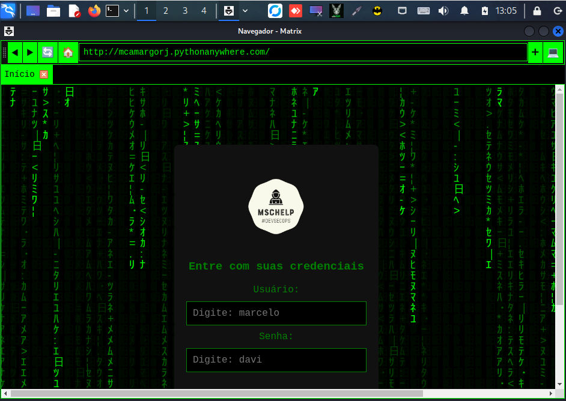

# NavegadorMatrix

**NavegadorMatrix** é um navegador de internet focado em segurança e privacidade. Inspirado no universo cinematográfico de "Matrix" e no mundo hacker, o objetivo deste projeto é criar uma ferramenta que minimize a exposição dos dados do usuário, oferecendo uma navegação mais segura e controlada.

---

## Características

- **Segurança de navegação**: O NavegadorMatrix foi projetado para garantir que suas informações pessoais e dados não sejam compartilhados sem o seu consentimento. Ele evita conexões desnecessárias e monitora os servidores com os quais interage.
  
- **Terminal integrado**: Navegue de maneira interativa, com um terminal embutido no navegador, permitindo a execução de programas diretamente enquanto navega pela internet.

- **Privacidade**: A ideia é limitar o rastreamento de dados, protegendo a privacidade dos usuários e dificultando ataques de malware.

- **Design temático**: O design do navegador foi inspirado no filme "Matrix" e no universo hacker, proporcionando uma experiência única para os usuários que curtem esse tema.

---


## 💖 Contribua!

Ajude a fortalecer o desenvolvimento seguro! Sua contribuição faz a diferença no futuro da MSCHelp.

Clique no link abaixo para fazer sua doação:

[**Faça uma doação no PayPal**](https://www.paypal.com/donate/?business=3ZQZK7TPGPSAA&no_recurring=0&item_name=Ajude+a+fortalecer+o+desenvolvimento+seguro%21+Sua+contribui%C3%A7%C3%A3o+faz+a+diferen%C3%A7a+no+futuro+da+MSCHelp.&currency_code=BRL)


## 🛠 Instalação

### 1️⃣ Clonar o repositório e configurar o ambiente

```bash
git clone https://github.com/seuusuario/NavegadorMatrix.git
cd NavegadorMatrix

# Criar e ativar o ambiente virtual (Windows)
python -m venv venv
venv\Scripts\activate

# Criar e ativar o ambiente virtual (Linux)
python -m venv venv
source venv/bin/activate

# Instalar as dependências
pip install -r requirements.txt

# Executar o NavegadorMatrix
python navegadormatrix.py

